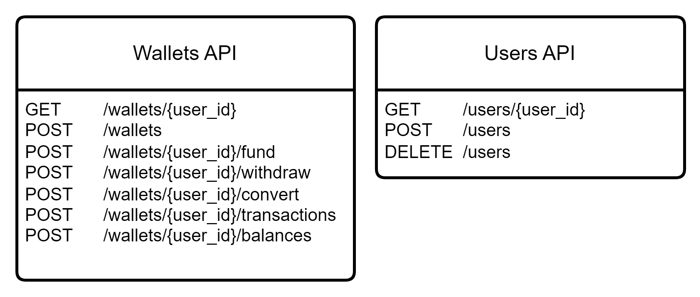

# FX Payment Processor

This is a simplified Payment Processor system build with the following technologies
- Python
    - FastApi framework
    - SqlModel ORM
- Docker
- Docker compose
- Postgresql

## Architecture

This project utilizes a rest API architecture composed of the following key components:

1.  usersController: Responsible for create and delete users.
2.  walletsController: Handles the operations to fund, withdraw, convert and get balance and transactions of a wallet.
3.  db: Is a postgresql instance with a paymentProcessor database where we save all the wallets, users and transactions data.


### DB Design

### API Desing

## Set up to deploy the services

To deploy the project you need to have docker installed in your computer then run the following commands in the project directory

Build the image
```bash
docker compose build
```
Deploy and start the containers (the -d flag is to detach the containers from the current cmd session)
```bash
docker compose up -d  
```

This will deploy a postgreSql instance with a database paymentProcessor with user and password "admin" also will deploy the api container and start it, but the service container has a constraint that if the db container does not pass the health check it wont start the service until the database is up and accepting connections.

### unit Tests
If you want to run the unit test you can create a session in the container cmd and run the next command so you can also see the test coverage.

The test conects to the database.

```bash
pytest --cov=/app
```

## Assumptions

For this simplified paymentProcessor we are taking the fallowing assumptions:

The system needs a user:

    The reason of taking this asumption is that in the prooblem description describe that the /wallets api gets the information based on the user_id, wee can use the wallet_id as user_id but, to make it a litle bit more real we create a user and a controller to create and delete users.

Each users needs a wallet to start with:

    When each user is created also a wallet is created and assigned to the user, so we can start funding that wallet, the default currency is USD.

The wallets can be crated by a user:

    Each time a user wants to fund a wallet with different currency, first needs to create a wallet if the users dosnt have a wallet with that currency and then proceed to do the funding.

The system needs a transaction table:

    Each time we do a fund, withdrawal or convertion we call it a transaction, so we create a table transactions to keep track of the transaction by wallet and by user, with the type of operation we are doing, the amount and the currency.

This is a simplified version so just one microservice:
    
    We divide this microservice in two controllers or routers, one for wallets and the other for users, but, in a real world scenario with high volumetry we should separate this controllers in two different apis usersApi and walletsApi so we can scale as needed each service without consumming not needed resources.

This service was write async:

    To optimize the performance of the service it works asyncronous with the fastApi framework so we dont block other users while we are doing database operations.

Insure data integrity for wallet:

    To ensure the integrity of the wallet balance while making fund, withdrawals and convertions so the service is using only one db connection to led the db lock the records for the session, but in case this has high volumetry, an optimistic lock with a pool of connections is a great idea.

Insure data percistence with soft delete for audit purposes.
